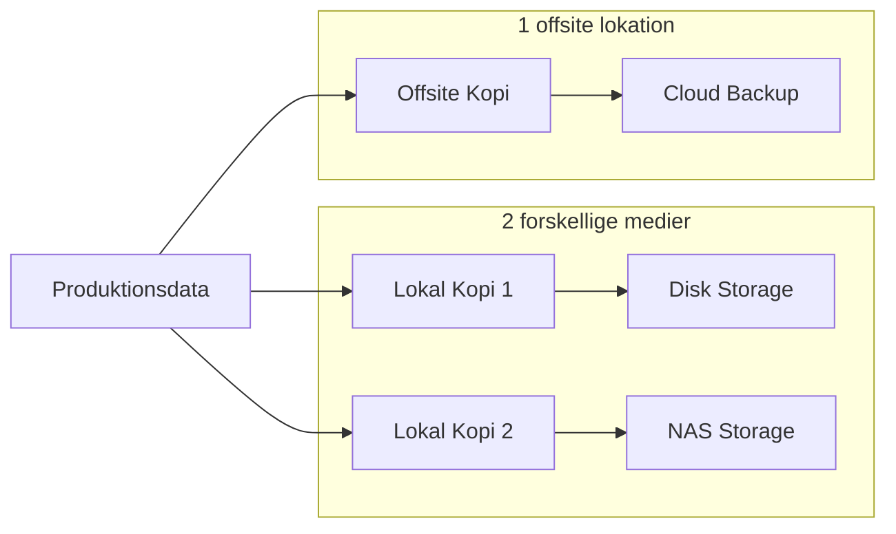

# Kravspecifikation - T&T Cloud Løsning

## 1. Projektets Omfang 

### 1.1 Overordnet Formål
- Implementation af privat cloud-løsning for T&T hotelkæde
- Skal understøtte nuværende 200 ansatte med 20-25% vækst over 3 år
- Integration af NextCloud som central komponent

### 1.2 Hovedkomponenter
1. **Infrastruktur**
   - Privat cloud setup
   - Firewall beskyttelse
   - Lokalt DNS og DHCP
   - Blandet Windows/Linux miljø

2. **Servere**
   - Mailserver
   - Webserver med CMS
   - Filserver (FTP/Samba)
   - Database server

3. **Backup & Sikkerhed**
   - 3-2-1 backup strategi
   - Valg mellem TrueNAS/Synology/Veeam
   - Kontinuerlig backup af kritiske systemer

## 2. Teknisk Arkitektur

### 2.1 High Availability Netværksdiagram

```mermaid
flowchart TB
    Internet((Internet)) --> LB[Load Balancer]
    LB --> |HA Link| FW1[PFSense Firewall 1]
    LB --> |HA Link| FW2[PFSense Firewall 2]
    
    subgraph DMZ
        direction TB
        FW1 --> |VLAN 10| WEB1[Web Server 1]
        FW1 --> |VLAN 10| WEB2[Web Server 2]
        FW1 --> |VLAN 11| MAIL1[Mail Server 1]
        FW1 --> |VLAN 11| MAIL2[Mail Server 2]
        
        FW2 --> |VLAN 10| WEB1
        FW2 --> |VLAN 10| WEB2
        FW2 --> |VLAN 11| MAIL1
        FW2 --> |VLAN 11| MAIL2
    end
    
    subgraph Internal Network
        direction TB
        FW1 --> |VLAN 20| DNS1[DNS Server 1]
        FW1 --> |VLAN 20| DNS2[DNS Server 2]
        FW1 --> |VLAN 21| DHCP1[DHCP Server 1]
        FW1 --> |VLAN 21| DHCP2[DHCP Server 2]
        
        FW2 --> |VLAN 20| DNS1
        FW2 --> |VLAN 20| DNS2
        FW2 --> |VLAN 21| DHCP1
        FW2 --> |VLAN 21| DHCP2
        
        subgraph NextCloud Cluster
            direction LR
            NC1[NextCloud Node 1] --- NC2[NextCloud Node 2] --- NC3[NextCloud Node 3]
        end
        
        subgraph MariaDB Galera Cluster
            direction LR
            DB1[MariaDB Node 1] --- DB2[MariaDB Node 2] --- DB3[MariaDB Node 3]
        end
        
        subgraph File Server Cluster
            direction LR
            FS1[File Server 1] --- FS2[File Server 2]
        end
    end
    
    subgraph Backup Infrastructure
        direction LR
        BK1[TrueNAS Node 1] --- BK2[TrueNAS Node 2]
        BK1 & BK2 --> OFFSITE[Offsite Backup]
    end
```

### 2.2 High Availability Komponenter

#### Kritiske Services med HA
1. **Database Cluster (MariaDB Galera)**
   - 3-node cluster for redundans
   - Automatisk failover
   - Multi-master replikering
   - Synkron replikering

2. **NextCloud Cluster**
   - Load-balanced setup
   - Delt storage backend
   - Session replikering
   - Automatisk failover

3. **Firewall (PFSense)**
   - Active-Passive setup
   - CARP floating IP
   - Automatisk state sync
   - Zero downtime failover

4. **DNS/DHCP**
   - Primary/Secondary setup
   - Automatisk zone transfer
   - Failover configuration

5. **Mail Server**
   - Active-Active configuration
   - Shared storage
   - Load balanced setup

6. **Web Services**
   - Load balanced configuration
   - Session persistence
   - Health checks
   - Automatic failover

7. **File Services**
   - Active-Active configuration
   - Distributed File System
   - Real-time sync

8. **Backup System**
   - Redundant NAS setup
   - Offsite replication
   - Point-in-time recovery

### 2.3 Monitoring og Alerting
- Nagios/Zabbix monitoring
- Service health checks
- Performance metrics
- Automatic failover triggers
- Alert notification system

## 3. Backup Strategi

## 4. Implementeringskrav
- [ ] Test lab på EXSI-server
- [ ] Isoleret virtuelt netværk
- [ ] NextCloud integration
- [ ] Firewall implementation
- [ ] Server opsætning
- [ ] Backup konfiguration

## 5. Dokumentationskrav
- [ ] Teknisk dokumentation
- [ ] Netværkstopologi
- [ ] ER-diagrammer
- [ ] Klassediagrammer
- [ ] Migrationsplan
- [ ] PowerPoint præsentation
- [ ] PDF-dokumentation

## 6. Tidsplan
- Projektstart: [Dato]
- Præsentation: [Dato + 14 dage]
- Implementation: Efter godkendelse

## 7. Spørgsmål der skal besvares
- [ ] Hvad er forskellen på Cloud Computing og Cloud Netværk?
- [ ] Hvad er SAAS, PAAS, IAAS?
- [ ] Hvad er forskellen på en privat cloud og public cloud?
- [ ] Hvad er Ubuntu cloud?
- [ ] Hvad er Openstack?
- [ ] Hvad er VMware vSphere?
- [ ] Hvad er Kubernetes og hvad kan det bruges til?
- [ ] Hvad er forskellen på Google Cloud vs AWS vs Azure?
- [ ] Hvad er forskellen på Cloud clostering og Cloud Computing?

## 8. Infrastruktur Specifikationer

### 8.1 Cloud Platform - Proxmox VE Cluster
- 3x Proxmox nodes i HA cluster
  - Node 1: Primary
  - Node 2: Secondary
  - Node 3: Tertiary
- Ceph distributed storage across nodes
- Redundant 10Gb netværk mellem nodes
- Quorum device for split-brain prevention

### 8.2 Komponent Oversigt

#### Frontend Services
- **Load Balancing**
  - 1x HAProxy Load Balancer (med floating IP)
  - 2x PFSense Firewalls i HA par (CARP)

#### DMZ Services (VLAN 10-11)
- **Web Platform**
  - 2x Web Servers (Apache/Nginx)
  - Load balanced configuration
  - SSL termination

- **Mail Platform**
  - 2x Mail Servers (Mailcow)
  - Active-Active configuration
  - Shared storage backend

#### Internal Services (VLAN 20-21)
- **DNS Infrastructure**
  - 2x DNS Servers (Bind9)
  - Master-Slave configuration
  - Automatic zone transfers

- **DHCP Services**
  - 2x DHCP Servers
  - Failover configuration
  - Scope replication

- **NextCloud Platform**
  - 3x NextCloud Nodes
  - Load balanced
  - Redis session storage
  - Shared NFS storage

- **Database Platform**
  - 3x MariaDB Galera Nodes
  - Multi-master replication
  - Automatic failover
  - Galera cluster sync

- **File Services**
  - 2x Samba Servers
  - Active-Active configuration
  - DFS replication

#### Backup Infrastructure
- **Storage Platform**
  - 2x TrueNAS Nodes i HA
  - ZFS storage pools
  - Snapshot replication
- **Offsite Backup**
  - 1x Cloud backup destination
  - Encrypted backup streams
  - Point-in-time recovery

### 8.3 Netværks VLAN Struktur
- VLAN 10: Web Services
- VLAN 11: Mail Services
- VLAN 20: Infrastructure Services (DNS/DHCP)
- VLAN 21: Internal Services (NextCloud/DB)
- VLAN 30: Storage Network
- VLAN 40: Management Network
- VLAN 50: Backup Network

### 8.4 Minimum Hardware Krav per Node

#### Proxmox Nodes (hver)
- CPU: 2x Intel Xeon (min. 16 cores total)
- RAM: 256GB ECC
- Storage:
  - 2x 480GB SSD (OS Mirror)
  - 4x 1.92TB NVMe (Ceph)
- Network: 4x 10Gb NIC

#### Storage Nodes (hver)
- CPU: 2x Intel Xeon (min. 8 cores total)
- RAM: 128GB ECC
- Storage:
  - 2x 480GB SSD (OS Mirror)
  - 8x 8TB SAS (Data)
- Network: 2x 10Gb NIC

### 8.5 Redundans Niveau
- Compute: N+1 redundans
- Storage: N+2 redundans
- Network: Alle forbindelser er redundante
- Power: Dual PSU på alle komponenter

### 8.6 Skalerbarhed
- Initial kapacitet: 200 brugere
- Skalerbar til: 250+ brugere
- Vækstplan:
  - År 1: 200 brugere
  - År 2: 240 brugere
  - År 3: 250+ brugere

### 8.7 Disaster Recovery
- RPO (Recovery Point Objective): 15 minutter
- RTO (Recovery Time Objective): 1 time
- Automatiseret failover mellem nodes
- Dokumenterede recovery procedurer