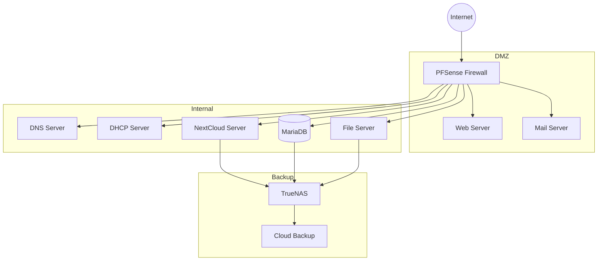

# Kravspecifikation - T&T Cloud Løsning (Simpel Version)

## 1. Projektets Omfang 

### 1.1 Overordnet Formål
- Implementation af privat cloud-løsning for T&T hotelkæde
- Skal understøtte nuværende 200 ansatte
- Integration af NextCloud som central komponent

## 2. Teknisk Arkitektur

## 3. Komponent Oversigt

### 3.1 Cloud Platform - Proxmox VE
- 1x Proxmox node
- Local ZFS storage
- 1Gb netværk

### 3.2 Services
#### Frontend
- 1x PFSense Firewall

#### DMZ (VLAN 10)
- 1x Web Server (Apache)
- 1x Mail Server (Mailcow)

#### Internal Network (VLAN 20)
- 1x DNS Server (Bind9)
- 1x DHCP Server
- 1x NextCloud Server
- 1x MariaDB Server
- 1x File Server (Samba)

#### Backup
- 1x TrueNAS Core
- Cloud Backup (Offsite)

### 3.3 Netværks VLAN Struktur
- VLAN 10: DMZ Services
- VLAN 20: Internal Services
- VLAN 30: Storage Network
- VLAN 40: Management

### 3.4 Minimum Hardware Krav

#### Proxmox Node
- CPU: 1x Intel Xeon (8 cores)
- RAM: 128GB ECC
- Storage:
  - 2x 480GB SSD (OS Mirror)
  - 4x 2TB SSD (VM Storage)
- Network: 2x 1Gb NIC

#### Storage Node (TrueNAS)
- CPU: 1x Intel Xeon (6 cores)
- RAM: 64GB ECC
- Storage:
  - 2x 240GB SSD (OS Mirror)
  - 4x 4TB SATA (Data, RAID10)
- Network: 2x 1Gb NIC

## 4. Backup Strategi
- Daglig backup til TrueNAS
- Ugentlig cloud backup
- 30 dages retention

## 5. Implementeringskrav
- [ ] Test lab på EXSI-server
- [ ] Isoleret virtuelt netværk
- [ ] NextCloud installation
- [ ] Firewall setup
- [ ] Server opsætning
- [ ] Backup konfiguration

## 6. Dokumentationskrav
- [ ] Teknisk dokumentation
- [ ] Netværkstopologi
- [ ] ER-diagrammer
- [ ] Klassediagrammer
- [ ] PowerPoint præsentation
- [ ] PDF-dokumentation

## 7. Tidsplan
- Projektstart: [Dato]
- Præsentation: [Dato + 14 dage]
- Implementation: Efter godkendelse

## 8. Begrænsninger
- Ingen redundans på services
- Begrænset skaleringsmuligheder
- Single point of failure på komponenter
- Begrænset netværkshastighed (1Gb)
- Manuel failover ved nedetid 